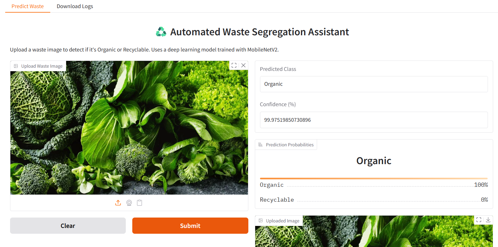
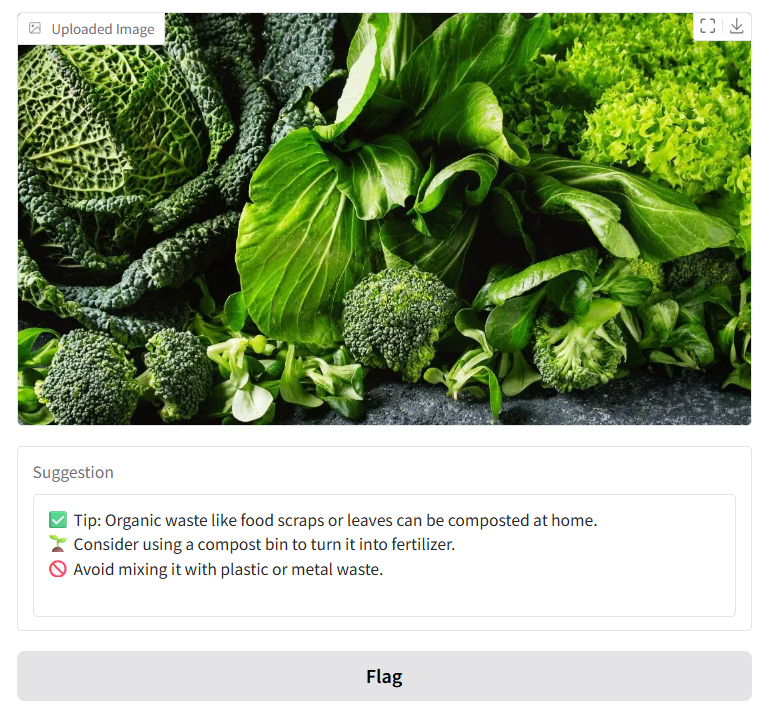
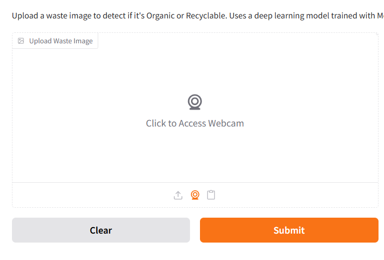
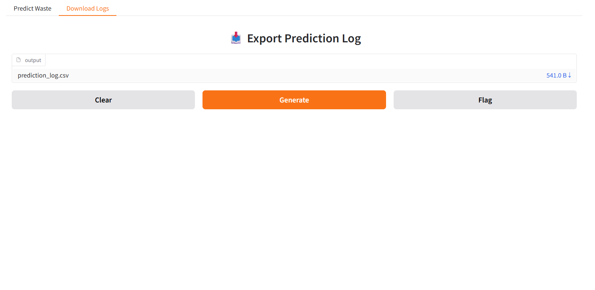

# ♻️ Automated Waste Segregation Assistant

An AI-powered image classification system that automatically categorizes waste into **Organic** or **Recyclable** using **MobileNetV2** and **Transfer Learning**. This project aims to promote sustainable waste management through deep learning and real-time deployment.

---

## 📌 Features

- 🔍 Classifies waste images into **Organic** or **Recyclable**
- 🧠 Uses **MobileNetV2** for transfer learning
- ⚙️ Built with **TensorFlow/Keras**
- 🖼️ Accepts image uploads for prediction
- 📊 Shows prediction confidence and class probabilities
- 🌐 Ready for deployment using **Gradio**

---

## 🧠 Model Overview

- **Base Model**: `MobileNetV2` (pretrained on ImageNet)
- **Custom Head**:
  - `GlobalAveragePooling2D`
  - `Dropout(0.3)`
  - `Dense(2, activation='softmax')`
- **Loss Function**: `categorical_crossentropy`
- **Optimizer**: `Adam`
- **Input Size**: 224x224 pixels
- **Training**:
  - 80% training
  - 20% validation
  - 10 epochs with augmentation

---

## 📁 File Structure

```
waste_classifier/
├── images/                         # 📁 Folder for visual outputs
│   ├── demo1.png                   # 🖼️ Individual prediction screenshots
│   ├── demo2.png
│   ├── demo3.png
│   ├── demo4.png
│
├── app.py                         # 🌐 Gradio web app for prediction
├── MLmodel.ipynb                  # 📒 Colab notebook (training & evaluation)
├── waste_model.h5                 # 🤖 Trained deep learning model
├── requirements.txt               # 📦 List of required Python libraries
└── README.md                      # 📘 Full project documentation

```

---

## 🚀 Getting Started

### 1️⃣ Clone the Repository

```bash
git clone https://github.com/rayshmika/waste_classifier.git
cd waste_classifier
```

### 2️⃣ Install Dependencies

```bash
pip install -r requirements.txt
```

> You can also import `waste_model.h5` and run predictions on new images.

---

## 🧪 How to Predict on Custom Images

```python
from tensorflow.keras.models import load_model
from tensorflow.keras.preprocessing import image
import numpy as np

model = load_model("waste_model.h5")
img = image.load_img("your_image.jpg", target_size=(224, 224))
img_array = np.expand_dims(image.img_to_array(img) / 255.0, axis=0)
pred = model.predict(img_array)
print("Predicted class:", np.argmax(pred))
```

---

## 🧾 Dataset

- **Source**: [Kaggle – Waste Classification Dataset](https://www.kaggle.com/datasets/techsash/waste-classification-data)
- **Classes**: `Organic`, `Recyclable`

---

## 📈 Sample Result






---

## 🔮 Future Enhancements

- Add more waste categories: Glass, E-waste, Hazardous, etc.
- Integrate into **smart bins** using Raspberry Pi + camera
- Convert model to **TensorFlow Lite** for Android apps
- Add voice/chat assistant for accessibility

---

## 📜 License

This project is licensed under the MIT License.

---

## 🧑‍💻 Created by

**Rashmika M**  
Email: rashmika.m07jk@gmail.com
